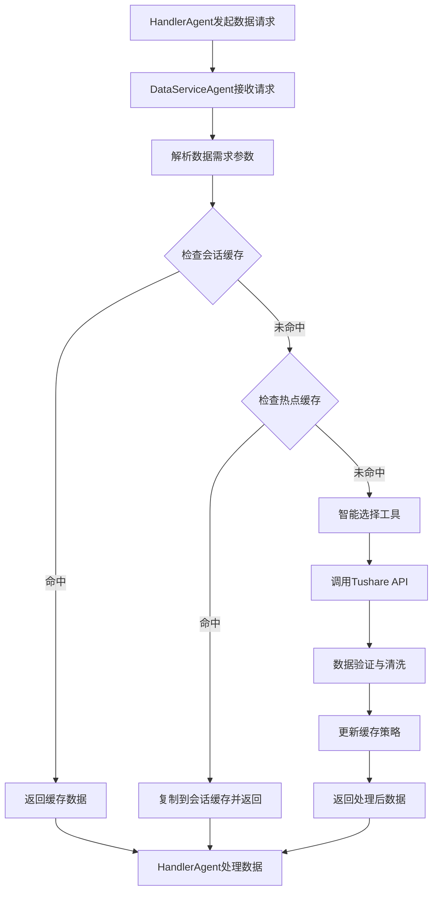
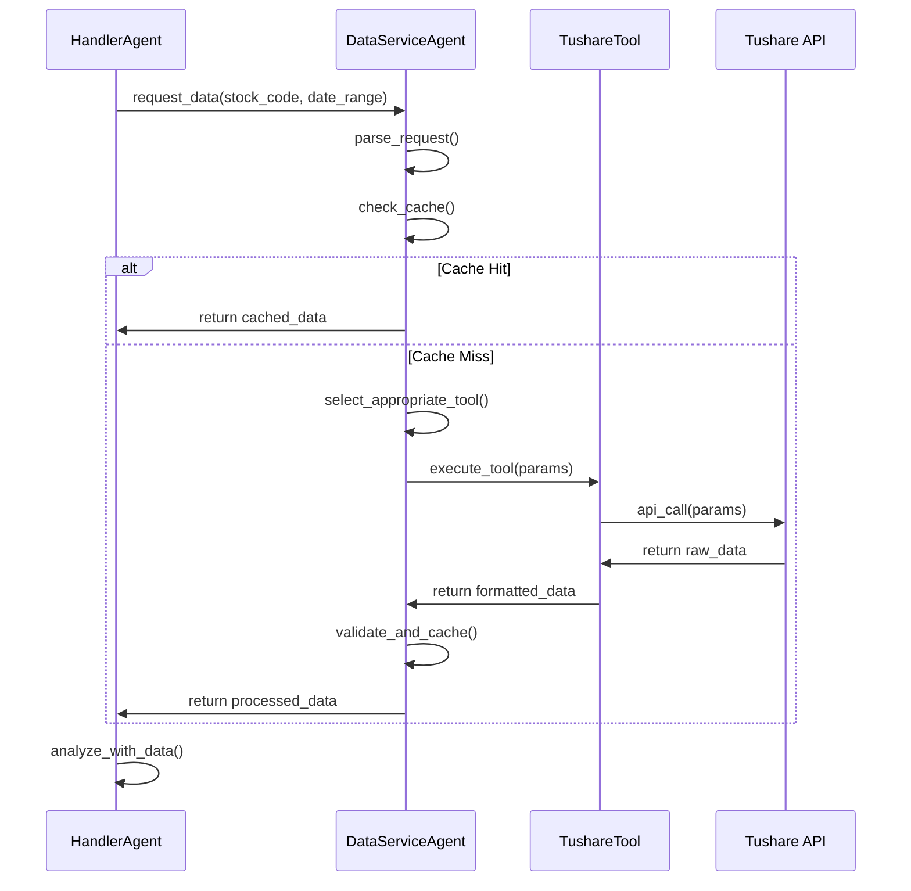

# DataServiceAgent 数据服务智能体设计文档

> **版本**: v1.0  
> **创建时间**: 2026-01-05  
> **作者**: Multi-Agent Quant Trader Team  

## 📋 概述

DataServiceAgent是Multi-Agent Quant Trader系统中的专业数据服务智能体，负责处理所有金融数据获取请求。该Agent通过集成Tushare API工具集，为其他Agent提供高效、可靠的数据服务支持。

## 🎯 设计目标

### 核心功能
- **智能数据路由**: 根据用户需求自动选择合适的数据工具
- **统一数据接口**: 为系统提供标准化的数据访问接口
- **高效缓存机制**: 通过内存缓存提升数据访问性能
- **错误处理**: 优雅处理API限流、网络异常等问题

### 性能要求
- **响应时间**: 缓存命中 < 100ms，API调用 < 3s
- **可靠性**: 99.5%的数据获取成功率
- **并发支持**: 支持多Agent同时数据请求
- **内存效率**: 智能缓存管理，避免内存溢出

## 🏗️ 系统架构

### 整体架构图
```
┌─────────────────┐    ┌──────────────────┐    ┌─────────────────┐
│   HandlerAgent  │───▶│  DataServiceAgent │───▶│  Tushare Tools  │
└─────────────────┘    └──────────────────┘    └─────────────────┘
                                │                        │
                                ▼                        ▼
                       ┌──────────────────┐    ┌─────────────────┐
                       │   Memory Cache   │    │   External API  │
                       └──────────────────┘    └─────────────────┘
```

### 组件层次结构
```
DataServiceAgent/
├── Core Agent Logic        # 核心Agent逻辑
├── Tool Management        # 工具管理模块  
├── Cache System          # 缓存系统
├── Error Handler         # 错误处理
└── Data Validator        # 数据验证
```

## 🛠️ 工具体系设计

### Tushare API工具集

#### 1. DailyDataTool - 日K线数据工具
```python
@tool
def get_daily_data(ts_code: str, start_date: str, end_date: str) -> Dict:
    """
    获取股票日线行情数据
    
    Args:
        ts_code: 股票代码(如000001.SZ)
        start_date: 开始日期(YYYYMMDD)
        end_date: 结束日期(YYYYMMDD)
    
    Returns:
        包含OHLCV数据的字典
    """
```

#### 2. MinuteDataTool - 分钟级数据工具
```python
@tool  
def get_minute_data(ts_code: str, start_date: str, end_date: str, freq: str) -> Dict:
    """
    获取分钟级K线数据
    
    Args:
        ts_code: 股票代码
        start_date: 开始日期
        end_date: 结束日期  
        freq: 频率(1min, 5min, 15min, 30min, 60min)
    
    Returns:
        分钟级OHLCV数据
    """
```

#### 3. AdjustFactorTool - 复权因子工具
```python
@tool
def get_adjust_factor(ts_code: str, start_date: str, end_date: str) -> Dict:
    """
    获取复权因子数据
    
    Args:
        ts_code: 股票代码
        start_date: 开始日期
        end_date: 结束日期
    
    Returns:
        复权因子数据
    """
```

#### 4. BasicInfoTool - 基础信息工具
```python
@tool
def get_stock_basic(exchange: str = None) -> Dict:
    """
    获取股票基础信息
    
    Args:
        exchange: 交易所代码(SSE上交所, SZSE深交所)
        
    Returns:
        股票基础信息列表
    """
```

#### 5. IndexDataTool - 指数数据工具
```python
@tool
def get_index_data(ts_code: str, start_date: str, end_date: str) -> Dict:
    """
    获取指数行情数据
    
    Args:
        ts_code: 指数代码(如000001.SH)
        start_date: 开始日期
        end_date: 结束日期
        
    Returns:
        指数OHLCV数据
    """
```

## 💾 数据传递策略

### 最佳实践：内存传递 + 智能缓存

#### 核心原则
1. **会话级内存缓存**: 单次对话期间数据保存在内存中
2. **直接对象传递**: Agent间传递原生Python对象
3. **智能缓存策略**: 根据数据特征决定缓存级别
4. **自动清理机制**: 会话结束后自动释放内存

#### 实现架构
```python
class DataServiceAgent:
    def __init__(self):
        self.session_cache = {}      # 会话级缓存
        self.hot_data_cache = {}     # 热点数据缓存
        self.cache_stats = {}        # 缓存统计
    
    async def get_data(self, request: DataRequest) -> Dict:
        # 1. 检查会话缓存
        cache_key = self._generate_cache_key(request)
        if cache_key in self.session_cache:
            return self.session_cache[cache_key]
        
        # 2. 检查热点数据缓存
        if cache_key in self.hot_data_cache:
            data = self.hot_data_cache[cache_key]
            self.session_cache[cache_key] = data
            return data
        
        # 3. 调用API获取数据
        tool = self._select_tool(request)
        data = await tool.execute(request.params)
        
        # 4. 数据验证
        validated_data = self._validate_data(data)
        
        # 5. 更新缓存
        self._update_cache(cache_key, validated_data, request)
        
        return validated_data
```

## 🔄 工作流程设计

### 数据请求处理流程



### Agent交互时序图



## 📊 缓存策略设计

### 多级缓存架构

#### 1. 会话级缓存 (Session Cache)
- **生命周期**: 单次对话会话
- **容量**: 50MB
- **策略**: LRU淘汰
- **用途**: 当前会话的所有数据请求

#### 2. 热点数据缓存 (Hot Data Cache)  
- **生命周期**: 24小时
- **容量**: 200MB
- **策略**: 基于访问频率的智能淘汰
- **用途**: 频繁访问的基础数据

#### 3. 缓存命中率优化
```python
class CacheManager:
    def __init__(self):
        self.hit_stats = {}
        self.access_patterns = {}
    
    def should_cache_hot(self, request):
        """判断是否应该缓存为热点数据"""
        key = self._get_request_pattern(request)
        frequency = self.access_patterns.get(key, 0)
        return frequency > 5  # 访问5次以上缓存为热点
    
    def get_cache_priority(self, request):
        """计算缓存优先级"""
        factors = {
            'access_frequency': self._get_frequency(request),
            'data_size': self._get_data_size(request), 
            'fetch_cost': self._get_api_cost(request),
            'update_frequency': self._get_update_freq(request)
        }
        return self._calculate_priority(factors)
```

## 🛡️ 错误处理机制

### 异常类型与处理策略

#### 1. API限流处理
```python
class RateLimitHandler:
    def __init__(self):
        self.retry_strategy = ExponentialBackoff(
            initial_wait=1.0,
            max_wait=60.0, 
            max_retries=3
        )
    
    async def handle_rate_limit(self, func, *args, **kwargs):
        for attempt in range(self.retry_strategy.max_retries):
            try:
                return await func(*args, **kwargs)
            except RateLimitError as e:
                wait_time = self.retry_strategy.get_wait_time(attempt)
                await asyncio.sleep(wait_time)
                continue
        raise MaxRetriesExceededError()
```

#### 2. 网络异常处理
```python
class NetworkErrorHandler:
    def __init__(self):
        self.fallback_strategies = [
            self._try_cached_data,
            self._use_alternative_source,
            self._return_mock_data
        ]
    
    async def handle_network_error(self, request):
        for strategy in self.fallback_strategies:
            try:
                return await strategy(request)
            except Exception:
                continue
        raise DataUnavailableError("所有数据源均不可用")
```

#### 3. 数据验证处理
```python
class DataValidator:
    def validate_stock_data(self, data):
        """验证股票数据完整性"""
        required_fields = ['ts_code', 'trade_date', 'open', 'high', 'low', 'close', 'vol']
        
        if not all(field in data.columns for field in required_fields):
            raise DataValidationError("缺少必需字段")
        
        if data.isnull().sum().sum() > len(data) * 0.1:
            raise DataValidationError("空值过多，数据质量不符合要求")
        
        return True
```

## ⚙️ 配置管理


### 系统提示词
```
你是一个专业的金融数据服务智能体，负责为其他Agent提供高质量的市场数据。

你拥有以下数据获取工具：
1. DailyDataTool: 获取股票日线数据 (开高低收量等)
2. MinuteDataTool: 获取分钟级K线数据 (支持1/5/15/30/60分钟)
3. AdjustFactorTool: 获取复权因子数据 
4. BasicInfoTool: 获取股票基础信息
5. IndexDataTool: 获取指数行情数据

工作原则：
- 根据请求需求智能选择最合适的工具
- 优先使用缓存数据，减少API调用
- 确保返回数据的完整性和准确性
- 处理异常情况，提供友好的错误信息

请根据用户的数据需求，选择合适的工具并返回标准格式的数据。
```


